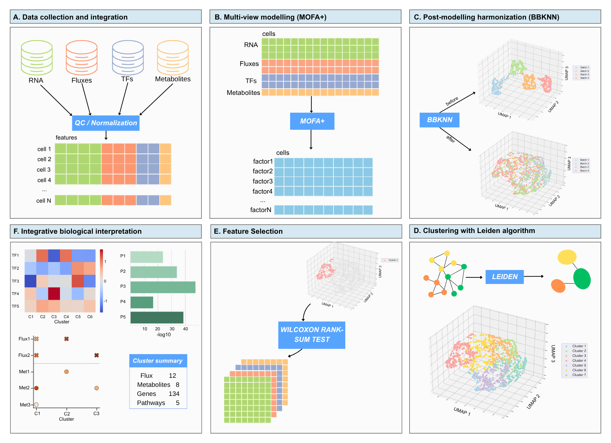

# Organizing regulatory and metabolic programs from scRNA-seq

### A practical companion to a latent-factor framework for functional representations derived from single-cell transcriptomics

Single-cell RNA sequencing directly measures transcript abundance, while computational methods can derive complementary representations of regulatory and metabolic cellular states.

This repository provides a practical companion to the framework presented in:

> **Napoli C, Bardozzo F, Verma S, et al. (2026)**  
> *A latent factor framework to organize regulatory and metabolic programs inferred from scRNA-seq*  
> **Bioinformatics Advances**, 6(1), vbag185.  
> DOI: [10.1093/bioadv/vbag185](https://doi.org/10.1093/bioadv/vbag185)

---

## Framework overview

The framework starts from a single scRNA-seq measurement and derives four complementary functional representations:

- **Gene expression** — transcriptional state
- **TF regulon activity** — regulatory programs inferred with pySCENIC
- **Metabolite-level features** — metabolic features predicted with scFEA
- **Reaction fluxes** — metabolic reaction activities predicted with scFEA

These representations are standardized and jointly organized using **MOFA+**, providing a shared latent representation for investigating coordinated transcriptional, regulatory, and metabolic programs.

<p align="center">
  
</p>

*Framework overview reproduced from Napoli et al. (2026).*

> **Important:** the four views are derived from the same transcriptomic measurement. They should therefore be interpreted as complementary computational representations rather than independent omics measurements.

---

## Practical guide

A step-by-step description of the workflow is available in the [Practical guide](docs/practical-guide.md).

The guide covers:

- construction of the transcriptomic, regulatory, and metabolic views;
- standardization and latent-factor modelling with MOFA+;
- post-modelling neighbourhood construction;
- clustering and robustness assessment;
- view-specific characterization of functional states;
- integrative biological interpretation.

It also distinguishes between the general methodological decisions that define the framework and the dataset-specific parameter choices used in the published case study.

---

## Workflow

The overall analytical strategy can be summarized as:

```text
scRNA-seq
   │
   ├── Gene expression
   ├── TF regulon activity
   ├── Metabolite-level features
   └── Reaction fluxes
              │
              ↓
        Standardization
              │
              ↓
            MOFA+
              │
              ↓
        Latent factors
              │
              ↓
   Neighbourhood construction
              │
              ↓
           Clustering
              │
              ↓
       Functional states
              │
              ↓
 View-specific characterization
              │
              ↓
 Integrative biological interpretation
```

For methodological details and guidance on adapting individual steps to other datasets, see the [Practical guide](docs/practical-guide.md).

---

## Citation

If you use this framework in your research, please cite:

> Napoli C, Bardozzo F, Verma S, et al. (2026).  
> **A latent factor framework to organize regulatory and metabolic programs inferred from scRNA-seq.**  
> *Bioinformatics Advances*, 6(1), vbag185.  
> https://doi.org/10.1093/bioadv/vbag185
